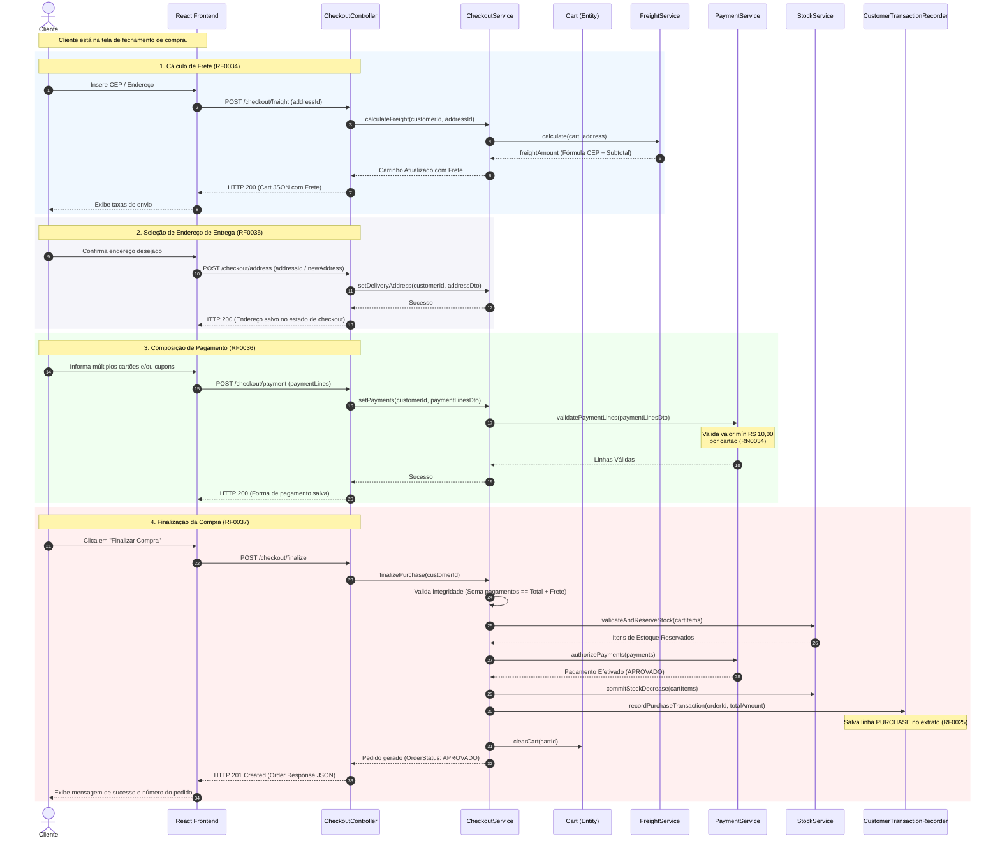
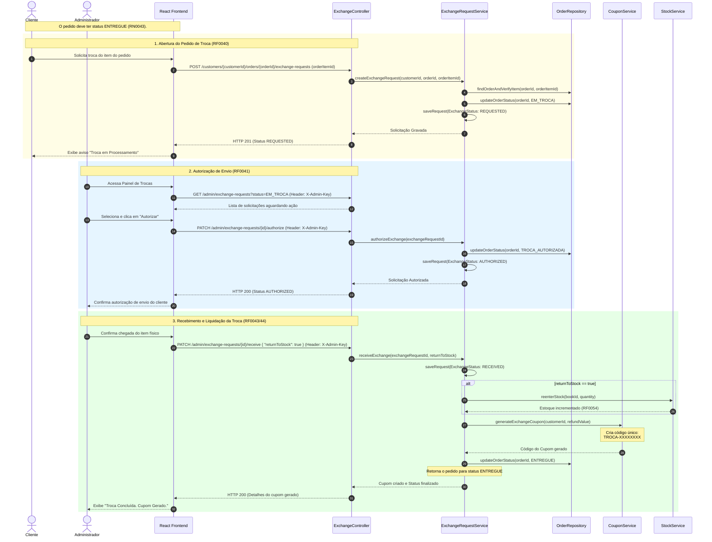
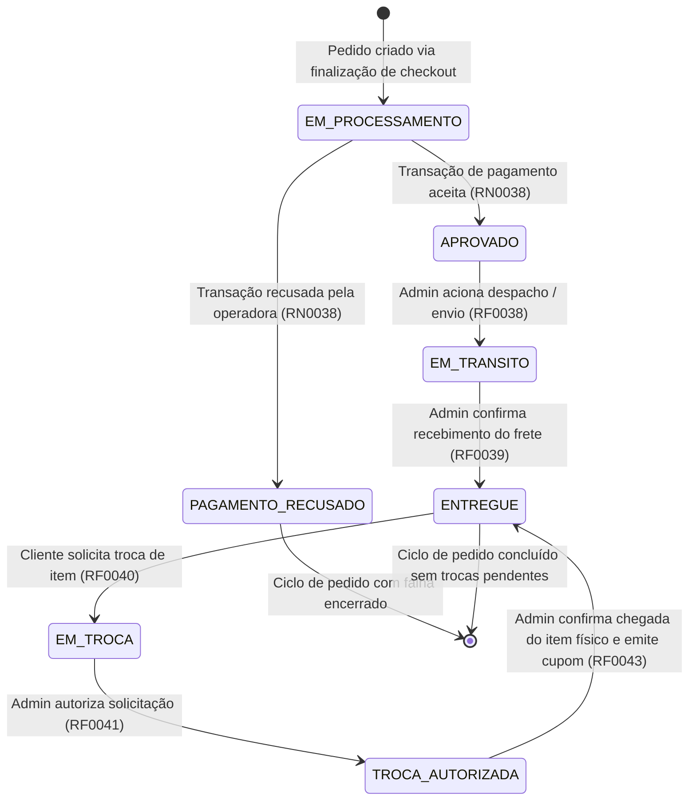
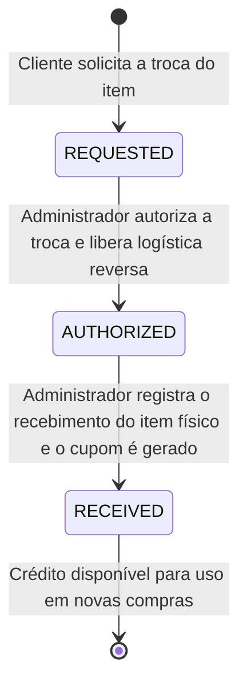

# Documento de Visão do Projeto: E-commerce de Livros (Matheus GN)

---

## 1. Introdução

Este documento apresenta a especificação da visão para o e-commerce de livros **Matheus GN**, desenvolvido como parte da disciplina de Laboratório de Engenharia de Software (LES) para o 1º semestre de 2026. O objetivo deste documento é consolidar e formalizar os objetivos do produto, sua arquitetura técnica, as personas envolvidas, os casos de uso detalhados, os fluxos operacionais representados por diagramas de sequência, os ciclos de vida de entidades críticas por meio de diagramas de estado, além dos requisitos e regras de negócio que orientam a engenharia do software.

### 1.1 Objetivo do Produto
O objetivo principal é construir uma plataforma de vendas eletrônicas focada no comércio de livros, permitindo aos clientes finais realizar compras seguras com regras de pagamento flexíveis (uso de múltiplos cartões e cupons de troca/promocionais), acompanhar o histórico de pedidos e gerenciar solicitações de troca. Para os administradores, o sistema fornece recursos robustos para gestão de catálogo de livros, controle estrito de estoque físico, autorização de trocas, auditoria detalhada de ações e análise de histórico de vendas através de ferramentas de Business Intelligence (BI).

### 1.2 Escopo do Sistema
O escopo compreende:
- **Interface Pública/Cliente:** Cadastro e manutenção de perfil, múltiplos endereços e cartões, catálogo dinâmico de livros, carrinho de compras temporário com temporizador de expiração, fluxo de checkout completo e painel de pedidos e trocas.
- **Interface Administrativa:** Operações sob credencial de chave de administração para gestão de livros (inativação automática/manual), controle manual de entrada de estoque, painel de expedição de pedidos (despacho/entrega), painel de recebimento e processamento de trocas com geração automática de cupons e módulo de análise estatística de vendas através de gráficos de linhas.
- **Serviços de IA Generativa:** Chatbot interativo e motor de recomendações personalizadas com base nas preferências e histórico de compras.

### 1.3 Definições, Acrônimos e Abreviaturas
*   **RF:** Requisito Funcional.
*   **RNF:** Requisito Não Funcional.
*   **RN:** Regra de Negócio.
*   **ISBN:** *International Standard Book Number* (Padrão Internacional de Numeração de Livro).
*   **H2:** Banco de dados relacional SQL em memória ou arquivo utilizado em ambiente de desenvolvimento.
*   **Coupon (Cupom de Troca/Promocional):** Títulos digitais de crédito aplicados como dedução no valor total da compra.

---

## 2. Posicionamento do Produto

### 2.1 Oportunidade de Negócio
No mercado atual de e-commerce, a venda de livros exige um controle fino de precificação baseado em margens dinâmicas de lucro e um processo flexível de pagamentos. Adicionalmente, sistemas tradicionais falham em prover fluxos transparentes de trocas de mercadoria, gerando atrito para o cliente e gargalos de logística reversa. O e-commerce **Matheus GN** resolve este problema integrando um controle de estoque rigoroso (com reaproveitamento de itens devolvidos), flexibilidade no checkout com múltiplos meios de pagamento e um motor moderno de recomendações por IA.

### 2.2 Instrução do Problema

| Elemento | Descrição |
| :--- | :--- |
| **O problema de** | Falta de rastreabilidade de estoque, complexidade no checkout com múltiplos cartões/cupons, atrito na devolução/troca de produtos e falta de personalização no engajamento do cliente. |
| **afeta** | Clientes finais da livraria e a equipe de administração/gerência de vendas. |
| **cujo impacto é** | Ineficiência na logística reversa, carrinhos abandonados por rigidez de pagamento, perda de vendas por falta de recomendação relevante e inconsistência nos dados de auditoria do estoque. |
| **uma boa solução seria** | Uma plataforma de e-commerce unificada com controle de transações (extrato financeiro do cliente), regras claras de inativação automática de livros sem mercado, checkout multicarteira estruturado e um fluxo de troca integrado que gera cupons em tempo real. |

### 2.3 Instrução de Posição do Produto

| Elemento | Descrição |
| :--- | :--- |
| **Para** | Leitores e compradores de livros na internet (clientes) e gestores de livraria (administradores). |
| **Quem** | Necessitam de uma plataforma ágil de compras e de um sistema de controle de vendas/estoque inteligente e seguro. |
| **O (nome do produto)** | E-commerce de Livros Matheus GN. |
| **Que** | Disponibiliza um catálogo inteligente integrado à IA, checkout multicarteira, controle de auditoria de dados e logística de troca automatizada. |
| **Ao contrário de** | E-commerces genéricos que limitam a divisão de pagamentos, não controlam estritamente margens de precificação por grupo e exigem processos manuais pesados para a logística de troca de mercadorias. |
| **Nosso produto** | Garante consistência de estoque com bloqueios temporários, validação externa de ISBN, auditoria transparente de todas as ações de escrita e relatórios em tempo real de vendas. |

---

## 3. Descrição dos Stakeholders e Usuários

### 3.1 Perfis de Usuários

#### Cliente Final
*   **Objetivo:** Navegar no catálogo, interagir com a IA para buscar livros, salvar seus cartões de crédito preferidos e endereços (entrega e cobrança), realizar compras dividindo o valor em múltiplos cartões/cupons e solicitar troca de produtos com facilidade.
*   **Nível Técnico:** Básico a intermediário. Utiliza navegadores web modernos em dispositivos desktop ou mobile.

#### Administrador do Sistema (Gestor/Gerente de Vendas)
*   **Objetivo:** Manter o catálogo de livros atualizado, autorizar e receber mercadorias devolvidas para troca, lançar entradas manuais de estoque, acompanhar o status dos pedidos para despacho e entrega e analisar o histórico de vendas através de relatórios e gráficos.
*   **Nível Técnico:** Intermediário. Interage com o painel administrativo autenticado por chave de segurança do sistema (`X-Admin-Key`).

### 3.2 Ambiente de Usuário
O sistema opera em uma arquitetura web responsiva:
*   **Frontend:** Executado no navegador do usuário final (Google Chrome, Firefox, Safari, Edge).
*   **Backend:** Hospedado em servidor de aplicação Java executando a JVM, comunicando-se com banco de dados SQL e serviços externos (IA Generativa e APIs de consulta de ISBN).

---

## 4. Visão Geral da Arquitetura do Sistema

O sistema é construído sobre uma arquitetura moderna dividida em camadas, com desacoplamento claro entre a interface de usuário (Frontend) e o motor de regras de negócio (Backend).

```mermaid
graph TD
    classDef client fill:#e1f5fe,stroke:#0288d1,stroke-width:2px;
    classDef server fill:#efebe9,stroke:#5d4037,stroke-width:2px;
    classDef db fill:#e8f5e9,stroke:#2e7d32,stroke-width:2px;
    classDef external fill:#fff3e0,stroke:#ef6c00,stroke-width:2px;

    %% Atores e Interfaces de Usuário
    Cliente["Navegador Cliente <br> (React App)"]:::client
    Admin["Painel Admin <br> (React App)"]:::client

    %% Backend Spring Boot
    subgraph Servidor de Aplicação (Backend Spring Boot)
        Controller["Rest Controllers <br> (Exposição de endpoints)"]:::server
        Service["Services Layer <br> (Regras de Negócio: Checkout, Estoque, Trocas)"]:::server
        Repository["Spring Data JPA <br> (Acesso a Dados)"]:::server
        AI_Service["AI Recommendation Service <br> (Motor de IA e Chatbot)"]:::server
    end

    %% Bancos de Dados e Serviços Externos
    DB[("Banco de Dados <br> Relacional H2 / SQL")]:::db
    ISBN_API["API Externa ISBN <br> (Validação de Metadados)"]:::external
    AI_API["Provedor Generativo IA <br> (Modelos LLM)"]:::external

    %% Conexões
    Cliente -->|HTTPS / JSON| Controller
    Admin -->|HTTPS / JSON + X-Admin-Key| Controller

    Controller --> Service
    Service --> Repository
    Service --> AI_Service
    
    Repository --> DB
    
    Service -->|Validação de Código| ISBN_API
    AI_Service -->|Prompt / Chat context| AI_API
```

---

## 5. Recursos e Módulos do Sistema

### 5.1 Cadastro de Clientes, Endereços e Cartões
*   **Identificação Única:** Cada cliente recebe um código imutável (`RNF0035`). A senha deve obedecer a critérios fortes de segurança (letras maiúsculas/minúsculas, caracteres especiais e min. 8 dígitos) e é persistida usando a função hash BCrypt (`RNF0031–33`).
*   **Endereços Flexíveis:** Armazenamento desacoplado de múltiplos endereços classificados como `DELIVERY` (Entrega) ou `BILLING` (Cobrança) (`RF0026`/`RN0021`/`RN0022`).
*   **Carteira de Cartões:** Cadastro de múltiplos cartões associados com definição de cartão preferencial (`RF0027`/`RN0024`/`RN0025`).

### 5.2 Catálogo e Gestão de Livros
*   **Código Automatizado:** Geração automática do código único do livro seguindo a máscara `LIVR-[sequencial 6 dígitos]-[checksum 2 dígitos]` (`RN0018`).
*   **Validação de ISBN:** Integração obrigatória com serviços externos de validação de ISBN antes de permitir a ativação de um livro no sistema (`RN0019`).
*   **Controle de Ciclo de Vida:** Ativação e inativação de livros com obrigatoriedade de registrar o motivo e a categoria de inativação/ativação (`RN0015`/`RN0017`).
*   **Inativação Automática:** Rotina programada para desativar livros que estejam com estoque zerado e cujo valor máximo de venda histórica seja inferior a um limite parametrizado (`RF0013`/`RN0016`).

### 5.3 Vendas e Checkout
*   **Controle de Carrinho:** Um carrinho ativo por cliente (`RF0033`). Bloqueio temporário de estoque no momento em que os itens entram no carrinho para prevenir *overbooking* de exemplares, com remoção automática de itens expirados (`RN0044`/`RNF0045`).
*   **Checkout Multietapas Consistente:**
    1.  **Cálculo de Frete:** Baseado na fórmula interna `12.90 + 2% do subtotal + (soma de dígitos do CEP × 0.15)` (`RF0034`).
    2.  **Definição de Endereço:** Escolha entre endereços cadastrados ou inclusão rápida de novos endereços aplicados apenas àquela compra (`RF0035`).
    3.  **Divisão de Pagamento:** Suporte para múltiplos cartões de crédito (valor mínimo de R$ 10,00 por cartão) combinado com cupons de troca e cupons promocionais (`RN0034`/`RN0035`).
    4.  **Finalização de Pedido:** Processamento síncrono que deduz estoque definitivamente, cancela o carrinho aberto e gera uma transação do tipo `PURCHASE` no extrato do cliente (`RF0037`/`RF0025`).

### 5.4 Processo de Troca e Devolução (Logística Reversa)
*   **Abertura de Solicitação:** Clientes podem requerer a troca de um item específico de pedidos previamente marcados como `ENTREGUE` (`RF0040`/`RN0043`).
*   **Autorização Administrativa:** O administrador analisa e autoriza a troca pendente, alterando o status do pedido para `TROCA_AUTORIZADA` (`RF0041`/`RF0042`).
*   **Recebimento e Reentrada de Estoque:** Ao registrar fisicamente a devolução, o administrador decide se o produto será reinserido no estoque (reentrada automática) (`RF0043`/`RF0054`).
*   **Emissão de Crédito (Cupom de Troca):** O sistema emite automaticamente um cupom de reembolso sob o padrão `TROCA-XXXXXXXX` contendo o valor integral pago pelo item devolvido, disponibilizando-o na carteira do cliente (`RF0044`).

### 5.5 Controle de Estoque
*   **Entrada de Mercadorias:** Registro manual contendo livro, quantidade (não nula), valor de custo, fornecedor e data de entrada (`RF0051`/`RN0051`/`RN0061`/`RN0062`/`RNF0064`).
*   **Equalização de Custo:** Quando lotes de um mesmo livro entram com custos de aquisição diferentes, o preço de venda é equalizado com base no maior valor de custo, aplicando-se a margem do grupo de precificação (`RN005x`).

### 5.6 Módulo de IA Generativa
*   **Chatbot Integrado:** Canal interativo para busca inteligente de livros, esclarecimento de dúvidas e recomendações em linguagem natural (`RNF0044`).
*   **Recomendações Dinâmicas:** Motor de IA que sugere livros na tela principal com base nas transações de compra e preferências salvas no perfil do usuário.

---

## 6. Casos de Uso do Sistema (UML Use Cases)

O diagrama a seguir consolida os principais Casos de Uso do sistema, separando as interações da área pública do cliente e a área restrita do administrador.

```mermaid
graph LR
    classDef actor fill:#e1f5fe,stroke:#0288d1,stroke-width:2px;
    classDef uc fill:#fff9c4,stroke:#fbc02d,stroke-width:1px;
    classDef ucad fill:#ffe0b2,stroke:#f57c00,stroke-width:1px;

    %% Atores
    Cliente((Cliente)):::actor
    Admin((Admin)):::actor

    %% Casos de Uso do Cliente
    subgraph Área Pública & Cliente
        UC_CadCliente(["UC01: Manter Cadastro <br> (Cliente)"]):::uc
        UC_Cart(["UC02: Gerenciar Carrinho <br> de Compra"]):::uc
        UC_Checkout(["UC03: Realizar Checkout <br> e Pagamento"]):::uc
        UC_Transacoes(["UC04: Consultar Extrato <br> de Transações"]):::uc
        UC_TrocaCli(["UC05: Solicitar Troca <br> de Livro"]):::uc
        UC_Chatbot(["UC06: Interagir com <br> Chatbot de IA"]):::uc
    end

    %% Casos de Uso do Admin
    subgraph Área Administrativa (Chave Obrigatória)
        UC_Livros(["UC07: Manter Catálogo <br> de Livros"]):::ucad
        UC_Estoque(["UC08: Registrar Entrada <br> de Estoque"]):::ucad
        UC_PedidosAd(["UC09: Despachar e <br> Entregar Pedidos"]):::ucad
        UC_TrocaAd(["UC10: Processar Trocas <br> (Autorizar/Receber)"]):::ucad
        UC_BI(["UC11: Analisar Gráficos <br> de Vendas (BI)"]):::ucad
    end

    %% Ligações Cliente
    Cliente --> UC_CadCliente
    Cliente --> UC_Cart
    Cliente --> UC_Checkout
    Cliente --> UC_Transacoes
    Cliente --> UC_TrocaCli
    Cliente --> UC_Chatbot

    %% Ligações Admin
    Admin --> UC_Livros
    Admin --> UC_Estoque
    Admin --> UC_PedidosAd
    Admin --> UC_TrocaAd
    Admin --> UC_BI
```

### 6.1 Matriz de Rastreabilidade: Atores x Casos de Uso

| ID | Nome do Caso de Uso | Atores Envolvidos | Requisitos Cobertos (RF) |
| :--- | :--- | :--- | :--- |
| **UC01** | Manter Cadastro (Cliente) | Cliente | RF0021, RF0022, RF0023, RF0024, RF0026, RF0027, RF0028 |
| **UC02** | Gerenciar Carrinho de Compra | Cliente | RF0031, RF0032 |
| **UC03** | Realizar Checkout e Pagamento | Cliente | RF0033, RF0034, RF0035, RF0036, RF0037 |
| **UC04** | Consultar Extrato de Transações | Cliente | RF0025 |
| **UC05** | Solicitar Troca de Livro | Cliente | RF0040 |
| **UC06** | Interagir com Chatbot de IA | Cliente | RNF0044 |
| **UC07** | Manter Catálogo de Livros | Administrador | RF0011, RF0012, RF0013, RF0014, RF0015, RF0016 |
| **UC08** | Registrar Entrada de Estoque | Administrador | RF0051, RF0052 |
| **UC09** | Despachar e Entregar Pedidos | Administrador | RF0038, RF0039 |
| **UC10** | Processar Trocas (Autorizar/Receber) | Administrador | RF0041, RF0042, RF0043, RF0044 |
| **UC11** | Analisar Gráficos de Vendas (BI) | Administrador | RF0055 |

---

## 7. Diagramas de Sequência (UML Sequence Diagrams)

### 7.1 Fluxo de Checkout e Finalização do Pedido
Este diagrama detalha a comunicação síncrona entre o navegador do Cliente, os controladores da API do Backend, o serviço de coordenação do Checkout e os submódulos de estoque e pagamento.



### 7.2 Fluxo de Solicitação e Recebimento de Troca
Este fluxo descreve o ciclo de vida da logística reversa, demonstrando a interação do Cliente iniciando o processo, e o Administrador autorizando e registrando o recebimento físico para geração do cupom de crédito.



---

## 8. Diagramas de Transição de Estados (Statecharts)

### 8.1 Ciclo de Vida do Pedido (`OrderStatus`)
O status do pedido representa o fluxo comercial da compra, desde a validação bancária até o encerramento de eventuais trocas.



### 8.2 Ciclo de Vida da Solicitação de Troca (`ExchangeStatus`)
Monitora o andamento individual da devolução de um item específico de uma venda já entregue.



---

## 9. Requisitos Não Funcionais (RNFs)

### 9.1 Desempenho e Eficiência
*   **Tempo de Resposta:** Todas as consultas no banco de dados para listagem de livros e clientes devem responder em no máximo 1 segundo sob carga normal (`RNF0011`).
*   **Paginação de Dados:** Endpoints de listagem pública e administrativa devem utilizar paginação obrigatória para mitigar consumo excessivo de memória e rede (`RNF0011`).

### 9.2 Segurança e Privacidade
*   **Proteção de Senhas:** Armazenamento seguro de senhas por algoritmo criptográfico de dispersão unidirecional salt-hashed BCrypt (`RNF0033`).
*   **Regras de Senha Forte:** O formulário de registro deve exigir no mínimo 8 caracteres contendo obrigatoriamente letras maiúsculas, minúsculas e símbolos especiais (`RNF0031`), além de campo obrigatório de confirmação idêntica (`RNF0032`).
*   **Autenticação Administrativa:** Todas as rotas administrativas críticas (`/admin`, `/inventory`, `/analytics`, `/audit-logs`) exigem a presença do cabeçalho HTTP `X-Admin-Key` correspondente à chave privada configurada no servidor (`X-Admin-Key`).

### 9.3 Confiabilidade e Rastreabilidade (Auditoria)
*   **Log de Transações de Dados:** Todas as operações de escrita (inserções, alterações e exclusões) no banco de dados devem gerar automaticamente registros de auditoria contendo timestamp, usuário executor, entidade alterada e os valores anteriores/posteriores (`RNF0012`).
*   **Idempotência de Processos:** Processos como a alimentação automática de sementes de demonstração (`app.demo.seed`) devem validar marcadores de integridade (como o ISBN real do primeiro livro) para não duplicar dados.

---

## 10. Regras de Negócio Cruciais (RNs)

### 10.1 Precificação e Margem de Vendas
*   **Cálculo Base:** O valor de venda de um livro é calculado a partir do custo de aquisição adicionando-se a porcentagem de margem de lucro parametrizada no seu respectivo Grupo de Precificação (`RN0013`).
*   **Equalização por Custo Máximo:** Se livros idênticos forem cadastrados em entradas com custos de aquisição diferentes, o sistema recalculará o preço de venda de todo o estoque deste item tomando como base o **maior custo** de aquisição registrado (`RN005x`).
*   **Validação de Preço de Venda:** Um livro somente pode sofrer alteração manual de valor se o novo preço mantiver a margem configurada pelo grupo de precificação. Alterações com valores inferiores a essa margem necessitam de validação/autorização explícita do gerente de vendas (`RN0014`).

### 10.2 Regras de Cobrança e checkout
*   **Limite de Parcelas e Cartões:** O cliente pode fracionar o pagamento da compra em múltiplos cartões de crédito, devendo cada cartão receber um débito mínimo de R$ 10,00 (`RN0034`).
*   **Priorização de Cupons:** É permitido pagar valores inferiores a R$ 10,00 no cartão de crédito apenas se cupons de troca ou cupons promocionais forem aplicados na mesma transação cobrindo a maior parte do subtotal (`RN0035`).
*   **Uso Limitado de Cupons Promocionais:** O sistema restringe o uso de no máximo 1 cupom promocional por transação de checkout (`RN0033`).
*   **Emissão de Troco de Cupom:** Se a soma dos cupons de troca superar o subtotal + frete do pedido, o sistema criará um novo cupom de troca correspondente ao saldo credor residual (`RN0036`).

### 10.3 Regras de Consistência de Estoque
*   **Prevenção de Compra de Itens Esgotados:** Não é permitido incluir no carrinho ou avançar no checkout se a quantidade requisitada exceder o saldo de estoque atual do livro (`RN0031`).
*   **Validação Tardira de Estoque:** Caso ocorram vendas simultâneas e o estoque do livro se esvaia entre o momento de inclusão no carrinho e a finalização, o sistema recalcula ou remove o item do carrinho notificando o cliente antes de permitir o fechamento (`RN0032`).
*   **Estorno de Transações Não Efetivadas:** Se um pedido em processamento for marcado como `PAGAMENTO_RECUSADO`, todos os itens reservados no carrinho e na ordem são desbloqueados e retornados ao estoque disponível (`RN0028`).

---

## 11. Conclusão

Este Documento de Visão atua como o alicerce normativo para o desenvolvimento, evolução e validação de testes do e-commerce de livros **Matheus GN**. O alinhamento rigoroso entre os diagramas UML fornecidos (Casos de Uso, Sequência e Estados) com o catálogo de requisitos e as regras de negócio em código garante que o software satisfaça plenamente os padrões acadêmicos de Engenharia de Software da disciplina LES, além de prover uma arquitetura extensível e robusta para novos módulos.
