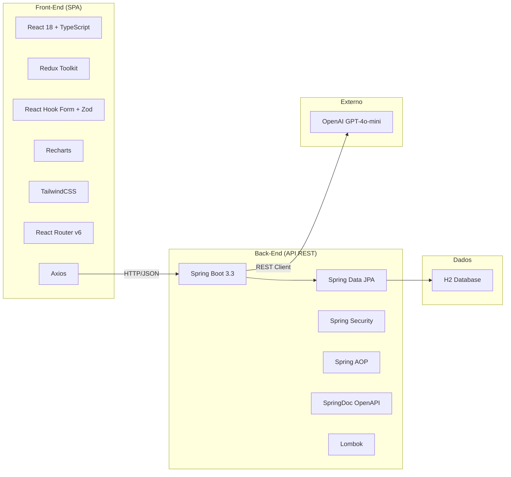
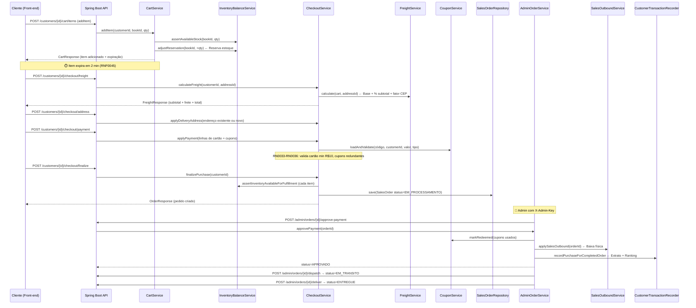
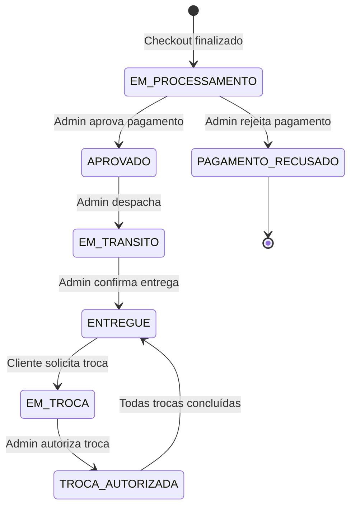
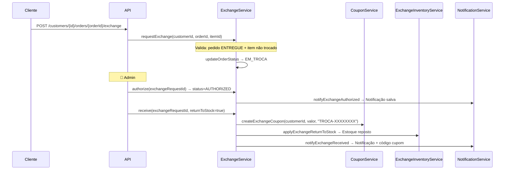
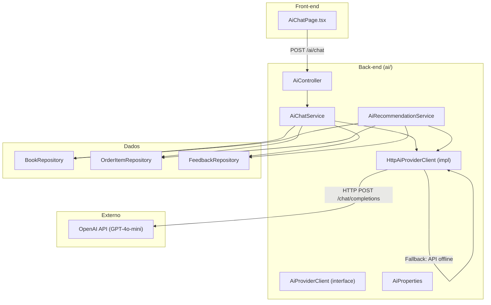
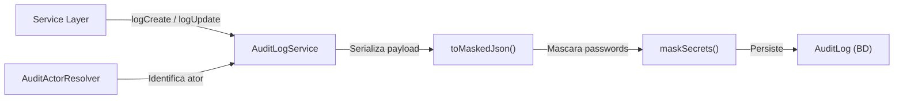
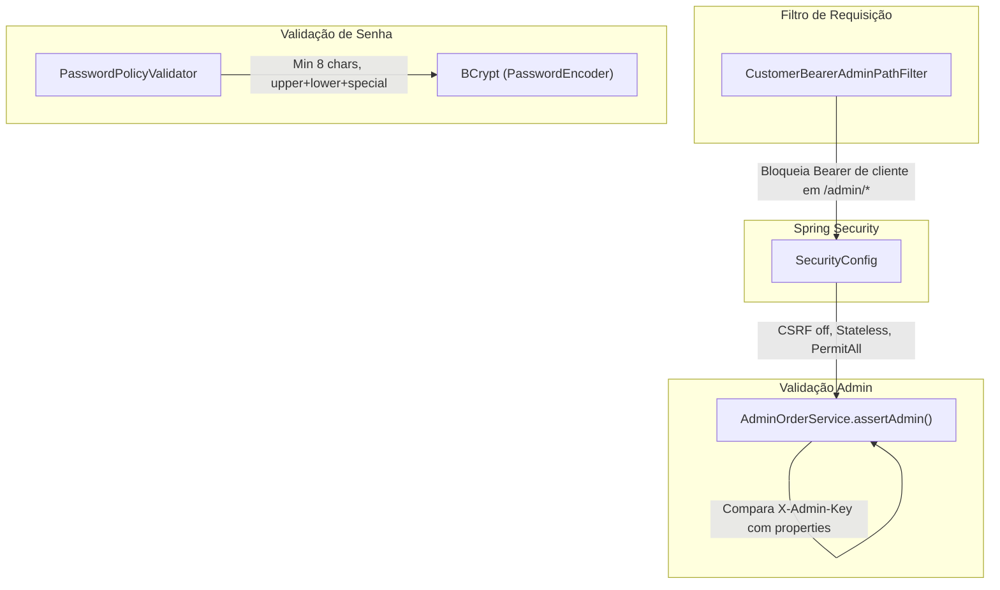
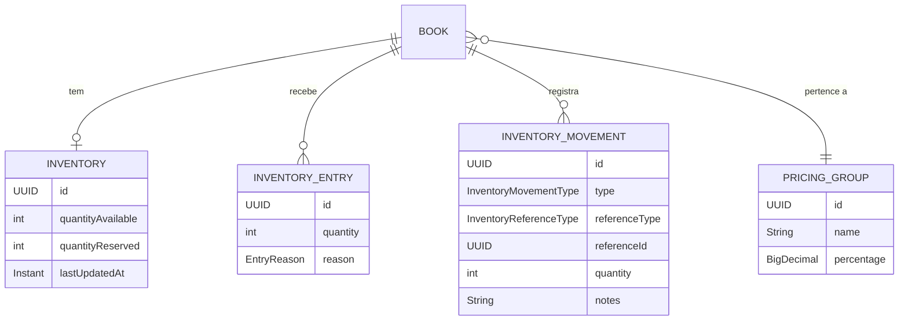

# 📚 Resumo Técnico Completo — E-Commerce de Livros (Bookstore LES)

> **Objetivo**: Preparar o estudante para uma apresentação acadêmica/profissional com profundidade técnica, explicações didáticas e roteiro de fala.

---

## 1. Visão Geral do Sistema

### O que é?
Uma **plataforma completa de e-commerce de livros** (back-end API REST + front-end SPA) que implementa o ciclo completo de venda online: cadastro de produtos, carrinho com expiração temporal, checkout multi-pagamento, logística (despacho/entrega), logística reversa (trocas com cupom), analytics e integração com Inteligência Artificial generativa.

### Tipo de Sistema
| Aspecto | Descrição |
|---|---|
| **Arquitetura** | API REST (Back-end) + SPA (Front-end) |
| **Padrão** | N-Tier / Camadas (Controller → Service → Repository) |
| **Back-end** | Spring Boot 3.3.5 / Java 17 |
| **Front-end** | React 18 + TypeScript + Vite + TailwindCSS + Redux Toolkit |
| **Banco** | H2 in-memory (dev) com JPA/Hibernate (DDL auto) |
| **Documentação** | Swagger/OpenAPI 3 via SpringDoc |
| **Testes** | JUnit 5 + Mockito + MockWebServer (back) / Playwright (front) |

### Stack Tecnológica Completa



---

## 2. Estrutura de Pacotes e Organização do Projeto

O projeto adota uma **organização por domínio de negócio (feature-based)** dentro de cada módulo, combinada com a separação por camada técnica internamente.

### Back-End — Árvore de Pacotes

```
com.matheusgn.ecommerce
├── EcommerceApplication.java       ← Ponto de entrada Spring Boot
├── ai/                             ← Módulo de IA (Recomendação + Chat)
│   ├── client/                     ← Interface + Implementação HTTP (OpenAI)
│   ├── config/                     ← Properties de configuração da IA
│   ├── controller/                 ← Endpoints REST do chatbot e recomendação
│   ├── dto/                        ← Objetos de request/response
│   ├── exception/                  ← AiProviderException
│   └── service/                    ← AiChatService, AiRecommendationService
├── analytics/                      ← Dashboard de vendas (admin)
│   ├── controller/
│   ├── dto/
│   └── service/                    ← SalesAnalyticsService, SalesLineChartService
├── audit/                          ← Auditoria (log de mudanças)
│   ├── controller/
│   ├── dto/
│   ├── entity/                     ← AuditLog, AuditActionType
│   ├── repository/
│   ├── service/                    ← AuditLogService
│   └── support/                    ← AuditActorResolver
├── auth/                           ← Autenticação (Bearer token registry)
├── book/                           ← Cadastro e gestão de livros
│   ├── controller/
│   ├── dto/
│   ├── entity/                     ← Book, BookLifecycleReason
│   ├── repository/
│   └── service/
├── common/                         ← Utilitários compartilhados
├── config/                         ← Configurações globais
│   ├── SecurityConfig.java         ← Spring Security (CSRF off, Stateless)
│   ├── CustomerBearerAdminPathFilter.java ← Filtro de segurança admin
│   ├── AdminProperties.java        ← Chave administrativa
│   ├── BookBusinessProperties.java
│   ├── CartItemProperties.java     ← Expiração de itens do carrinho
│   ├── PageConstraints.java        ← Limites de paginação
│   └── PasswordEncoderConfig.java  ← BCrypt
├── customer/                       ← Cadastro completo de clientes
│   ├── bootstrap/                  ← Seed de dados demo
│   ├── controller/                 ← 4 Controllers (Perfil, Endereços, Cartões, Transações)
│   ├── dto/
│   ├── entity/                     ← Customer, Address, CreditCard, CustomerTransaction, CustomerNotification
│   ├── repository/
│   ├── service/                    ← 7 Services especializados
│   └── validation/                 ← PasswordPolicy (Custom Bean Validation)
├── demo/                           ← DemoDataSeederService (dados iniciais)
├── domain/                         ← Entidades de domínio auxiliares
│   ├── controller/
│   ├── dto/
│   ├── entity/                     ← Author, Category, Publisher, Supplier
│   ├── repository/
│   └── service/
├── exception/                      ← Tratamento global de erros
│   ├── GlobalExceptionHandler.java ← @RestControllerAdvice (ProblemDetail/RFC 7807)
│   ├── ResourceNotFoundException
│   ├── DuplicateResourceException
│   ├── ForbiddenException
│   └── AuthenticationFailedException
├── feedback/                       ← Avaliações de livros (nota + comentário)
│   ├── entity/                     ← Feedback (Book + Customer + Rating)
│   └── repository/
├── health/                         ← Endpoint de health check
├── inventory/                      ← Gestão de estoque e precificação
│   ├── config/
│   ├── controller/
│   ├── dto/
│   ├── entity/                     ← Inventory, InventoryEntry, InventoryMovement, PricingGroup
│   ├── repository/
│   └── service/                    ← 7 Services (Balance, Entry, Movement, Exchange, Pricing, etc.)
└── sales/                          ← Módulo de vendas (core do negócio)
    ├── controller/                 ← 6 Controllers (Cart, Checkout, Orders, Admin, Exchange, Coupons)
    ├── dto/                        ← 20+ DTOs
    ├── entity/                     ← Cart, CartItem, SalesOrder, OrderItem, Payment, Coupon, ExchangeRequest
    ├── repository/                 ← 7 Repositories + Specifications
    ├── service/                    ← 10 Services (Cart, Checkout, Freight, Exchange, Coupon, Admin, etc.)
    └── util/                       ← OrderNumberFormatter
```

### Por que essa organização é superior?

| Critério | Organização por Feature | Organização por Camada |
|---|---|---|
| **Coesão** | ✅ Tudo de "sales" junto | ❌ Controllers de todos os módulos misturados |
| **Navegação** | ✅ Fácil encontrar o que pertence ao mesmo domínio | ❌ Precisa navegar entre pacotes distantes |
| **Escalabilidade** | ✅ Novo módulo = novo pacote | ❌ Pacotes crescem indefinidamente |
| **Microserviços** | ✅ Fácil extrair um pacote para microsserviço | ❌ Refatoração pesada |

### Front-End — Árvore de Diretórios

```
front-end/src/
├── app/                  ← Store Redux global
├── components/           ← Componentes reutilizáveis
├── constants/            ← Constantes da aplicação
├── features/             ← Feature slices (Redux Toolkit)
│   ├── ai/
│   ├── analytics/
│   ├── auth/
│   ├── books/
│   ├── cart/
│   ├── checkout/
│   └── customer/
├── hooks/                ← Custom hooks
├── layouts/              ← Layout principal
├── pages/                ← 22+ páginas
│   ├── HomePage.tsx
│   ├── BooksPage.tsx / BookDetailPage.tsx
│   ├── CartPage.tsx / CheckoutPage.tsx
│   ├── LoginPage.tsx / RegisterPage.tsx
│   ├── AiChatPage.tsx
│   ├── Admin*.tsx (8 páginas admin)
│   └── profile/ (5 páginas de perfil)
├── routes/               ← Configuração de rotas (React Router v6)
├── services/             ← API clients (Axios)
├── styles/               ← Estilos globais
├── types/                ← TypeScript interfaces
├── utils/                ← Utilitários
└── validators/           ← Validação Zod
```

---

## 3. Fluxo Completo da Aplicação — Ciclo de Vida de um Pedido



### Máquina de Estados do Pedido



---

## 4. Regras de Negócio Implementadas (com código-fonte)

### 4.1 Carrinho com Expiração Temporal (RNF0045)

O sistema implementa **expiração automática de itens no carrinho** (2 minutos por padrão). Quando um item expira:
- A **reserva de estoque é liberada** (soft release)
- O item permanece visível mas **marcado como expirado** (o cliente pode re-adicionar)
- O checkout é **bloqueado** até resolver itens expirados

> **Trecho-chave**: [CartService.java](file:///c:/Users/Matheus%20Costa/Downloads/matheus-gn/back-end/src/main/java/com/matheusgn/ecommerce/sales/service/CartService.java#L191-L203) — `releaseExpiredReservationsSoft()`

### 4.2 Reserva de Estoque no Carrinho (RN0044)

O estoque é **reservado no momento da adição ao carrinho**, impedindo overselling. O `InventoryBalanceService` mantém dois contadores:
- `quantityAvailable` — estoque físico total
- `quantityReserved` — unidades reservadas em carrinhos ativos

> **Quantidade vendável** = `quantityAvailable - quantityReserved`

> **Trecho-chave**: [InventoryBalanceService.java](file:///c:/Users/Matheus%20Costa/Downloads/matheus-gn/back-end/src/main/java/com/matheusgn/ecommerce/inventory/service/InventoryBalanceService.java#L36-L44) — `getSellableQuantity()`

### 4.3 Pagamento Multi-Cartão e Cupom (RN0033–RN0036)

O checkout suporta **múltiplas linhas de pagamento**:
- **Cartão de crédito**: mínimo R$ 10 por linha (exceção: linha única combinada com cupom)
- **Cupom de troca** (`EXCHANGE_COUPON`): gerado automaticamente após troca
- **Cupom promocional** (`PROMOTIONAL_COUPON`): criado pelo admin

Regras validadas:
- Cupom duplicado nas linhas → erro
- Cupom desnecessário (outros já cobrem o total) → erro (RN0036)
- Soma dos pagamentos deve cobrir exatamente o `grandTotal` (itens + frete)
- **Troco**: se cupons excedem o total (sem cartão), é emitido um novo cupom de troca com a diferença

> **Trecho-chave**: [CheckoutService.java](file:///c:/Users/Matheus%20Costa/Downloads/matheus-gn/back-end/src/main/java/com/matheusgn/ecommerce/sales/service/CheckoutService.java#L204-L242) — `validateCardAndPromoRulesFromPaymentRequest()`

### 4.4 Frete Dinâmico

Fórmula: **Frete = Base (R$ 12,90) + 2% do subtotal + fator CEP × R$ 0,15**

O fator CEP é calculado pela soma dos dígitos numéricos do CEP, criando variação geográfica.

> **Trecho-chave**: [FreightService.java](file:///c:/Users/Matheus%20Costa/Downloads/matheus-gn/back-end/src/main/java/com/matheusgn/ecommerce/sales/service/FreightService.java#L23-L36)

### 4.5 Precificação Automática por Grupo (RF0052 / RN0014)

O sistema implementa **grupos de precificação** (`PricingGroup`) com margem percentual. Quando um livro tem custo e grupo definidos:

**Preço de venda = Custo × (1 + Margem%/100)**

O administrador pode alterar o preço abaixo da margem mínima usando o header `X-Sales-Manager-Key`.

> **Trecho-chave**: [PricingService.java](file:///c:/Users/Matheus%20Costa/Downloads/matheus-gn/back-end/src/main/java/com/matheusgn/ecommerce/inventory/service/PricingService.java#L27-L38)

### 4.6 Inativação Automática de Livros (RF0013)

Livros com vendas abaixo de um valor mínimo são inativados automaticamente via endpoint dedicado.

### 4.7 Troca Parcial e Total com Geração de Cupom



**Fluxo de status da troca**: `REQUESTED → AUTHORIZED → RECEIVED`

---

## 5. Módulo de Inteligência Artificial

### 5.1 Arquitetura do Módulo IA



### 5.2 Dois Serviços Distintos

| Serviço | Função | Contexto Enviado à IA |
|---|---|---|
| **AiChatService** | Chat livre (assistente virtual) | Catálogo completo de livros ativos (título, autor, categoria, preço, estoque, sinopse) + dados do cliente + compras recentes + feedbacks |
| **AiRecommendationService** | Recomendação personalizada | Catálogo + histórico de compras (15 mais recentes) + feedbacks (10 mais recentes) |

### 5.3 Fallback Inteligente (Design Resiliente)

Quando a API OpenAI não está disponível (chave inválida, timeout, etc.), o `HttpAiProviderClient` **NÃO quebra**. Ele implementa um **fallback local** que:

1. Analisa a mensagem do usuário via NLP básico (normalização, detecção de categorias)
2. Busca livros no banco de dados por correspondência de título/autor/categoria
3. Retorna recomendações formatadas a partir dos dados reais do catálogo
4. Caso o banco esteja vazio, retorna uma lista estática de sugestões

> **Por que isso importa**: Garante que o sistema nunca fique sem funcionalidade de IA, mesmo em ambientes sem rede (como demonstrações acadêmicas).

> **Trecho-chave**: [HttpAiProviderClient.java](file:///c:/Users/Matheus%20Costa/Downloads/matheus-gn/back-end/src/main/java/com/matheusgn/ecommerce/ai/client/HttpAiProviderClient.java#L94-L254) — `getFallbackResponse()`

---

## 6. Analytics e Dashboard de Vendas

### Endpoints e Capacidades

| Endpoint | Serviço | O que retorna |
|---|---|---|
| `GET /admin/analytics/summary` | `SalesAnalyticsService` | Receita total, itens vendidos, nº de pedidos (por período) |
| `GET /admin/analytics/by-books` | `SalesAnalyticsService` | Receita e volume por livro (ranking) |
| `GET /admin/analytics/by-categories` | `SalesAnalyticsService` | Receita e volume por categoria |
| `GET /admin/analytics/line-chart` | `SalesLineChartService` | Receita diária (gráfico de linha) |
| `GET /admin/analytics/category-volume` | `SalesLineChartService` | Volume mensal por categoria (gráfico empilhado) |

### Visualização no Front-End

O front-end utiliza **Recharts** para renderizar:
- **Gráfico de linha**: receita diária ao longo do período
- **Gráfico de barras empilhadas**: volume de vendas por categoria/mês

> **Página**: [AdminAnalyticsPage.tsx](file:///c:/Users/Matheus%20Costa/Downloads/matheus-gn/front-end/src/pages/AdminAnalyticsPage.tsx)

---

## 7. Auditoria Completa (Compliance)

### Como Funciona

O `AuditLogService` registra **toda criação e atualização** de entidades sensíveis:



**Entidades auditadas**: `Customer`, `SalesOrder`, `ExchangeRequest`

**Proteção de dados sensíveis**: Campos com nome contendo `password` são substituídos por `***` antes de persistir.

> **Trecho-chave**: [AuditLogService.java](file:///c:/Users/Matheus%20Costa/Downloads/matheus-gn/back-end/src/main/java/com/matheusgn/ecommerce/audit/service/AuditLogService.java#L67-L84) — `maskSecrets()`

---

## 8. Segurança e Autenticação

### Camadas de Segurança



| Mecanismo | Descrição |
|---|---|
| **X-Admin-Key** | Header fixo para rotas administrativas (`AdminOrderService.assertAdmin()`) |
| **CustomerBearerAdminPathFilter** | Impede que tokens de cliente acessem rotas `/admin/**` |
| **BCrypt** | Senhas de clientes criptografadas com `PasswordEncoder` |
| **PasswordPolicy** | Validação customizada: min 8 chars, maiúscula, minúscula, caractere especial |
| **Spring Security** | CSRF desabilitado (API stateless), frame options sameOrigin (H2 console) |

---

## 9. Tratamento de Erros (RFC 7807 — Problem Details)

O `GlobalExceptionHandler` centraliza **todas** as exceções e retorna respostas padronizadas no formato **RFC 7807 (ProblemDetail)**:

| Exceção | HTTP Status | Exemplo |
|---|---|---|
| `ResourceNotFoundException` | 404 | "Livro não encontrado" |
| `DuplicateResourceException` | 409 | "ISBN já cadastrado" |
| `ForbiddenException` | 403 | "Chave administrativa inválida" |
| `AuthenticationFailedException` | 401 | "Falha de autenticação" |
| `IllegalArgumentException` | 400 | "Carrinho vazio" |
| `DataIntegrityViolationException` | 409 | Detecção inteligente de UK violations (ISBN, email, CPF) |
| `MethodArgumentNotValidException` | 400 | Erros de Bean Validation (campo por campo) |
| `AiProviderException` | 503 | "Provedor de IA indisponível" |

> **Trecho-chave**: [GlobalExceptionHandler.java](file:///c:/Users/Matheus%20Costa/Downloads/matheus-gn/back-end/src/main/java/com/matheusgn/ecommerce/exception/GlobalExceptionHandler.java)

---

## 10. Gestão de Estoque (Módulo Inventory)

### Modelo de Dados



### Fluxos de Movimentação

| Operação | Tipo | Quem dispara |
|---|---|---|
| **Reserva** (carrinho) | `adjustReservation(+delta)` | CartService.addItem |
| **Liberação** (expiração/remoção) | `adjustReservation(-delta)` | CartService.releaseExpired |
| **Baixa** (venda aprovada) | `decreaseStock()` | SalesOutboundService |
| **Devolução** (troca recebida) | `increaseStock()` | ExchangeInventoryService |
| **Entrada manual** | `increaseStock()` | InventoryEntryService |

---

## 11. Front-End — Telas e Funcionalidades

### Mapa de Páginas

| Página | Arquivo | Funcionalidade |
|---|---|---|
| **Home** | `HomePage.tsx` | Vitrine de livros em destaque |
| **Catálogo** | `BooksPage.tsx` | Listagem com filtros (título, autor, categoria) |
| **Detalhe do Livro** | `BookDetailPage.tsx` | Info completa + botão "Adicionar ao Carrinho" |
| **Carrinho** | `CartPage.tsx` | Itens, quantidades, expiração visual, total |
| **Checkout** | `CheckoutPage.tsx` | Endereço + Frete + Pagamento multi-linha (50KB!) |
| **Login/Registro** | `LoginPage.tsx`, `RegisterPage.tsx` | Autenticação de cliente |
| **Chat IA** | `AiChatPage.tsx` | Interface de chat com o assistente IA |
| **Perfil** | `ProfileOverviewPage.tsx` | Dados pessoais, edição |
| **Endereços** | `ProfileAddressesPage.tsx` | CRUD de endereços (entrega/cobrança) |
| **Cartões** | `ProfileCardsPage.tsx` | CRUD de cartões de crédito |
| **Pedidos** | `ProfileOrdersPage.tsx` | Histórico + solicitar troca |
| **Transações** | `ProfileTransactionsPage.tsx` | Extrato financeiro do cliente |
| **Admin - Livros** | `AdminBooksPage.tsx` (42KB) | CRUD completo + inativação + precificação |
| **Admin - Pedidos** | `AdminOrdersPage.tsx` | Gestão logística (aprovar, despachar, entregar) |
| **Admin - Trocas** | `AdminExchangesPage.tsx` | Autorizar/receber trocas |
| **Admin - Cupons** | `AdminCouponsPage.tsx` | Criar/ativar/desativar cupons |
| **Admin - Clientes** | `AdminCustomersPage.tsx` | Gestão de clientes |
| **Admin - Estoque** | `AdminInventoryPage.tsx` | Entradas + movimentações |
| **Admin - Analytics** | `AdminAnalyticsPage.tsx` | Dashboards com gráficos Recharts |
| **Admin - Auditoria** | `AdminAuditPage.tsx` | Log de auditoria completo |

### Tecnologias do Front-End

| Tecnologia | Uso |
|---|---|
| **React Hook Form** | Formulários com validação performática |
| **Zod** | Schemas de validação TypeScript-first |
| **Redux Toolkit** | Estado global (auth, cart, books) |
| **Recharts** | Gráficos interativos (analytics) |
| **Axios** | Chamadas HTTP à API |
| **React Router v6** | Navegação SPA com rotas protegidas |
| **React Markdown** | Renderizar respostas da IA (chat) |
| **TailwindCSS** | Estilização utilitária |

---

## 12. Padrões de Projeto Aplicados

| Padrão | Onde é aplicado | Benefício |
|---|---|---|
| **Repository Pattern** | Todos os `JpaRepository` | Abstrai o acesso ao banco; facilita trocar de ORM |
| **DTO (Data Transfer Object)** | Pacotes `dto/` em cada módulo | Desacopla modelo interno da interface pública |
| **Builder** | Todas as entidades com `@Builder` (Lombok) | Criação fluente e imutável de objetos |
| **Strategy** | `AiProviderClient` (interface) + `HttpAiProviderClient` (impl) | Permite trocar provedor de IA sem alterar services |
| **Template Method** | `GlobalExceptionHandler` com handlers específicos | Cada exceção tem tratamento próprio, mas segue o mesmo template |
| **Specification** | `SalesOrderSpecifications`, `CustomerSpecifications` | Filtros dinâmicos composáveis para queries JPA |
| **Observer** | `@EntityListeners(AuditingEntityListener.class)` | Auditing automático (createdAt, updatedAt) |
| **Facade** | `CheckoutService` orquestra 10+ dependências | Simplifica o fluxo complexo de checkout |
| **Filter Chain** | `CustomerBearerAdminPathFilter` | Intercepta requisições antes do controller |

---

## 13. Roteiro para Apresentação Oral

### Slide 1 — Introdução (2 min)
> "Desenvolvemos um sistema de e-commerce de livros completo — back-end em Spring Boot e front-end em React — que implementa todas as regras de um comércio online real: desde o cadastro de produtos até a logística reversa de trocas, passando por precificação inteligente e integração com IA generativa."

### Slide 2 — Arquitetura (3 min)
> "Adotamos uma arquitetura de camadas N-Tier com organização por domínio de negócio. Cada módulo (book, customer, sales, inventory, ai) é autocontido com seus controllers, services e repositories. Isso facilita a manutenção e permitiria, futuramente, extrair módulos como microsserviços."

### Slide 3 — Fluxo de Venda (4 min)
> "O fluxo de venda é complexo. Ao adicionar um item ao carrinho, o estoque é reservado em tempo real. O item expira em 2 minutos para evitar lock eterno. No checkout, o cliente escolhe endereço, calcula frete, e pode combinar múltiplos cartões com cupons de troca ou promocionais. Após o pagamento ser aprovado pelo admin, aí sim ocorre a baixa de estoque e o extrato do cliente é atualizado."

### Slide 4 — Logística Reversa (3 min)
> "Implementamos um fluxo completo de troca: o cliente solicita, o admin autoriza (com notificação ao cliente), e ao receber o produto, o admin pode devolver ao estoque e gerar automaticamente um cupom de troca no valor do item. Esse cupom é utilizável em compras futuras."

### Slide 5 — IA Generativa (3 min)
> "Integramos IA generativa da OpenAI via um chat assistente. O diferencial é que injetamos o catálogo real da loja no contexto do LLM, então as recomendações são de livros que realmente existem no sistema. Além disso, implementamos um fallback inteligente que funciona mesmo sem conexão com a API externa."

### Slide 6 — Analytics e Auditoria (2 min)
> "O painel administrativo inclui dashboards com receita diária, ranking de livros mais vendidos e volume por categoria, usando gráficos interativos. Toda alteração em entidades sensíveis é auditada com mascaramento automático de senhas."

### Slide 7 — Conclusão (2 min)
> "O sistema é auditável, escalável e atende a regras de negócio complexas. Com mais de 80 classes Java e 22 páginas no front-end, demonstramos domínio em engenharia de software aplicada, desde padrões de projeto até integração com IA."

---

## 14. Perguntas Prováveis da Banca (Q&A)

### Q: "Por que separar Controller, Service e Repository?"
> **R**: Para garantir o **princípio da responsabilidade única (SRP)**. O Controller só lida com HTTP (receber request, retornar response). O Service contém 100% da regra de negócio. O Repository é uma abstração do banco. Isso permite testar cada camada isoladamente com mocks e evoluir a regra sem impactar a interface.

### Q: "Como a IA foi integrada?"
> **R**: Criamos uma abstração `AiProviderClient` (Strategy Pattern). A implementação `HttpAiProviderClient` monta um prompt contextualizado injetando o catálogo real de livros, histórico de compras e feedbacks do cliente, e envia para a API OpenAI (GPT-4o-mini). Se a API falhar, um fallback local responde com dados do banco de dados.

### Q: "Como garantem que o estoque não seja vendido duas vezes (overselling)?"
> **R**: Usamos reserva em tempo real. Ao adicionar ao carrinho, o `InventoryBalanceService.adjustReservation()` incrementa `quantityReserved`. A quantidade vendável é `available - reserved`. Se o item expira no carrinho (2 min), a reserva é liberada. Na finalização, validamos novamente o estoque físico.

### Q: "Como funciona o pagamento com múltiplas formas?"
> **R**: O checkout aceita N linhas de pagamento, cada uma com tipo (CREDIT_CARD, EXCHANGE_COUPON, PROMOTIONAL_COUPON) e valor. Validamos regras como: mínimo R$ 10 por cartão, sem cupons redundantes, soma deve cobrir o total. Se cupons excedem o valor (sem cartão), geramos um cupom de troco.

### Q: "Por que usar H2 e não MySQL/Postgres em produção?"
> **R**: H2 é usado apenas em dev/test para agilidade (zero configuração). O JPA abstrai o banco; migrar para PostgreSQL exige apenas trocar o driver, URL e credenciais no `application.yml`. Nenhuma linha de código Java precisa mudar.

### Q: "Qual padrão usaram para tratamento de erros?"
> **R**: Usamos o **RFC 7807 (Problem Details)** com `ProblemDetail` do Spring 6. Todas as exceções são centralizadas no `GlobalExceptionHandler` com `@RestControllerAdvice`, que mapeia cada tipo para um HTTP status adequado (404, 409, 400, 403, 503). Isso dá ao front-end uma interface de erro previsível e padronizada.

### Q: "O que poderia melhorar?"
> **R**: (1) JWT para autenticação real de usuários em vez de Bearer fixo. (2) Redis para cache de consultas frequentes. (3) Testes de integração end-to-end mais abrangentes. (4) Event-driven architecture com mensageria (Kafka/RabbitMQ) para desacoplar a baixa de estoque do checkout. (5) Containerização com Docker + CI/CD.

### Q: "Como funciona a auditoria?"
> **R**: O `AuditLogService` é chamado explicitamente nos services (não é AOP mágico — é rastreável). Ele serializa o payload para JSON, mascara campos sensíveis como `password`, identifica o ator via `AuditActorResolver` e persiste um `AuditLog` com timestamp. O admin pode consultar por entidade/id.

---

## 15. Métricas do Projeto

| Métrica | Valor |
|---|---|
| **Classes Java** | ~80+ |
| **Pacotes** | 15 módulos (ai, analytics, audit, auth, book, common, config, customer, demo, domain, exception, feedback, health, inventory, sales) |
| **Entidades JPA** | 22+ (Book, Customer, Address, CreditCard, Cart, CartItem, SalesOrder, OrderItem, Payment, Coupon, ExchangeRequest, Inventory, InventoryEntry, InventoryMovement, PricingGroup, AuditLog, Feedback, Author, Category, Publisher, Supplier, CustomerNotification, CustomerTransaction) |
| **Endpoints REST** | 50+ |
| **DTOs** | 40+ (request + response) |
| **Services** | 25+ |
| **Páginas Front-end** | 22+ |
| **Feature Slices** | 7 (ai, analytics, auth, books, cart, checkout, customer) |
| **Linhas de código** | ~15.000+ (back) + ~12.000+ (front) |

---

## 16. Pontos de Melhoria para Discussão

| Área | Melhoria | Justificativa |
|---|---|---|
| **Segurança** | Substituir `X-Admin-Key` por JWT (Spring Security) | Autenticação stateless real com expiração de token |
| **Banco** | Migrar para PostgreSQL com Flyway | Persistência real + versionamento de schema |
| **Cache** | Redis para consultas frequentes (catálogo) | Reduzir carga no banco |
| **Mensageria** | Kafka/RabbitMQ para eventos (pedido criado, estoque baixado) | Desacoplamento + resiliência |
| **Observabilidade** | SLF4J + Logback + ELK Stack | Rastreamento de transações financeiras |
| **DevOps** | Docker + docker-compose + CI/CD (GitHub Actions) | Deploy automatizado e reproduzível |
| **Testes** | Ampliar cobertura: integration tests, contract tests | Garantia de qualidade |
| **API** | Rate limiting + API versioning (v1, v2) | Proteção contra abuso + evolução segura |
